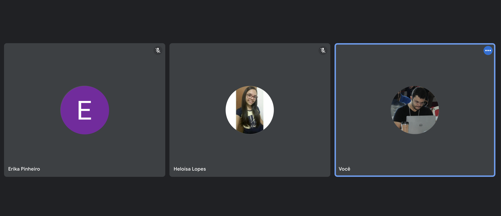

# Apresentações do dia 16-07-2021

As apresentações do dia 16-07-2021 foram feitas por Heloisa e Erica para demonstrar os conhecimentos relacionados com o que estão estudando sobre *Flexbox*.

Flexbox é uma técnica bastante utilizada no mercado para criar interfaces e estruturar de forma mais simples os elementos na tela. Utilizando conceitos de container e items é possível facilitar inclusive a responsividade de implementado Flexbox da forma correta.

Neste projeto Erica e Heloisa desenvolveram a seguinte tela utilizando conceitos de Flexbox:

Basicamente através de conteúdos gratuítos elas conseguiram aprender bastante coisas importantes sobre Flexbox e o resultado é o projeto que pode ser visto abaixo:

## Projetos apresentados

Abaixo pode ser encontrado o projeto de todos os alunos de forma comprimida. Caso queira visualizar o resultado é preciso baixar o arquivo e abrir na sua máquina:

| Aluno    | Projeto                 | Curso   |
| -------- | ----------------------- | ------- |
| Heloisa  | [Google Meets][heloisa] | Flexbox |
| Erica    | [Google Meets][erica]   | Flexbox |

## Conteúdos estudados

* [\[Flexbox\] FreeCodeCamp - Responsive Web Design - CSS Flexbox](https://www.freecodecamp.org/learn/responsive-web-design/#css-flexbox)

[//]: # (These are reference links used in the body of this note and get stripped out when the markdown processor does its job. There is no need to format nicely because it shouldn't be seen.)

[heloisa]: <heloisa>
[erica]: <erica>
